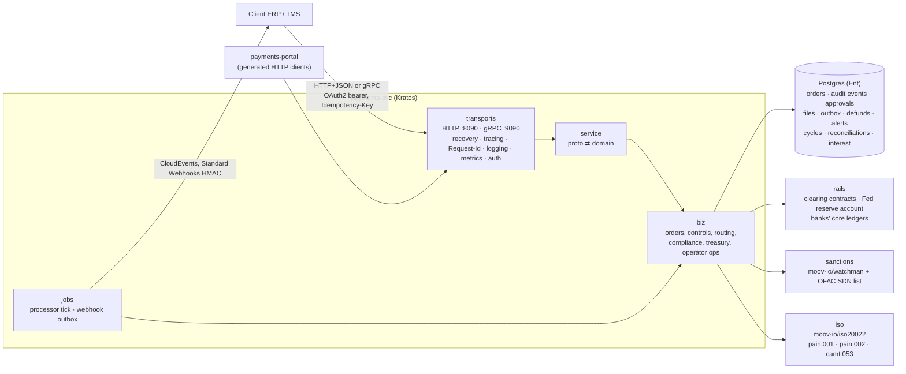

# payments-svc

A member bank's payment hub over the settlement network, built with
go-kratos, proto-first APIs, Wire and Ent, and with moov-io's payments
libraries where the job is a financial standard:

- the **corporate payment channel**: payment orders by API or ISO 20022
  pain.001 file, maker-checker, limits, payee checks, pain.002 status
  reports, camt.053 statements and signed status webhooks;
- the **bank's operations console**: OFAC sanctions review, settlement money
  and its funding, intraday liquidity against collateral, defunds under
  maker-checker;
- **the operator's network console**: members, the Fed reserve account
  against the token's reserve pool, the intraday pool, netting cycles,
  reconciliation, and reserve interest passed through to holders.

`services/payments-portal` is the web front end: server-rendered pages that
call this API through the generated Kratos HTTP clients, nothing else.

## How a client's payment uses the contracts

Clients see deposit accounts and payment orders. Underneath, each route is
one of the repository's mechanisms:

| Route | What happens | Contracts |
|---|---|---|
| Same bank | A book transfer between two deposit accounts | none |
| `URGENT`, another bank, 24x7 | The payer's deposit is issued as the paying bank's deposit token, then **converted**: burned at the paying bank, settlement money moved between the banks, the receiving bank's token minted, in one transaction or not at all. The receiving bank redeems it into the payee's account, so no client ever holds a token. | `DepositToken`, `ConversionBridge`, `SettlementToken` |
| `NORMAL`, another bank | The deposit is debited and an **obligation** between the banks is queued. Nothing moves until a cycle: the hub plans the largest feasible set off-chain, submits it to the plan book as a solver, and the engine re-verifies every net position before moving value. | `NettingEngine`, `NettingPlanBook` |

A bank's treasury keeps its **settlement money**: issued against reserves it
sends into the reserve account (Fedwire BTRC while Fedwire is open, FedNow
LMT1 while it is closed), earmarked for a defund the moment one is
requested, and returned as reserves once the defund is approved. When an
urgent payment is short and Fedwire is shut, treasury can **draw intraday
liquidity** from the pool against tokenized T-bills at the pool's advance
rate and curve, and repay with interest; a payment waiting for liquidity
goes the moment either arrives.

The operator **passes reserve interest through**: the Fed credits interest to
the reserve account, the settlement token's accrual index divides it among
holders by holdings (no units are minted), and each member is paid its share
over Fedwire. Sub-cent remainders go to the operator's own account, so the
reserve account again equals the reserve pool to the cent.

## Architecture



| Concern | Choice |
|---|---|
| Service framework | [go-kratos v2](https://go-kratos.dev): app lifecycle, HTTP and gRPC transports, middleware, config with `${ENV:default}` |
| API definition | protobuf with `google.api.http` annotations (`api/payments/v1`); Kratos generates the HTTP routes and clients, protoc the gRPC stubs, `protoc-gen-openapi` the OpenAPI document served at `/v1/openapi.yaml` |
| Dependency injection | [Wire](https://github.com/google/wire) (`cmd/payments-svc/wire.go`) |
| Persistence | [Ent](https://entgo.io) on PostgreSQL through pgx; pure-Go SQLite (modernc) for tests and local runs |
| ISO 20022 | [moov-io/iso20022](https://github.com/moov-io/iso20022): pain.001.001.10 parsed, pain.002.001.11 and camt.053.001.08 written from its message types |
| Sanctions | [moov-io/watchman](https://github.com/moov-io/watchman): the Treasury's SDN CSVs parsed by its OFAC reader, names scored with its Jaro-Winkler similarity |
| Routing numbers | [moov-io/ach](https://github.com/moov-io/ach) `CheckRoutingNumber` (ABA check digit) |
| Banking days | [moov-io/base](https://github.com/moov-io/base) Federal Reserve holiday calendar (OFAC reporting deadlines) |
| Authentication | OpenID Connect access tokens ([go-oidc](https://github.com/coreos/go-oidc)); static tokens in demo builds only |
| Notifications | CloudEvents 1.0 envelopes, [Standard Webhooks](https://www.standardwebhooks.com) signatures, transactional outbox |
| Metrics | Prometheus at `/metrics` |

## Layout

The standard go-kratos service layout:

```
api/payments/v1/     *.proto and generated *.pb.go, *_grpc.pb.go, *_http.pb.go
cmd/payments-svc/    main.go (config, prod guard), wire.go, wire_gen.go, providers.go
cmd/ofac-download/   fetches the current SDN list from treasury.gov
configs/             config.yaml (demo)
ent/schema/          PaymentOrder, OrderEvent, Approval, PaymentFile,
                     WebhookSubscription, WebhookDelivery, Defund, Alert,
                     NettingCycle, Reconciliation, InterestDistribution
internal/
  biz/        domain, ports (repos, rails, screener), use cases, processor
  data/       Ent repositories, transactions carried in the context
  service/    generated service interfaces, proto ⇄ domain
  server/     Kratos HTTP and gRPC servers, middleware, health, metrics
  rails/      the clearing contracts, the Fed and the banks' systems behind biz.Rails
  sanctions/  watchman-backed OFAC screening
  iso/        moov-io/iso20022 reader and writers
  notify/     outbox dispatcher, signatures, secret box, safe dialer
  auth/       bearer-token middleware (OIDC, static)
  jobs/       background loops as a Kratos server
  buildinfo/  demo vs production build tag
test/         black-box end-to-end test (binary, anvil, generated clients)
```

## API

Five services, 36 RPCs; each is also a REST route.

| Service | Routes | Who |
|---|---|---|
| `PaymentService` | `POST /v1/payments` · `GET /v1/payments[/{id}]` · `POST /v1/payments/{id}/approve\|decline\|cancel` · `GET /v1/payments/{id}/pain002` · `POST /v1/payment-files` · `GET /v1/payment-files/{id}/pain002` · `POST /v1/payees/verify` · `GET /v1/network/participants` | client organizations |
| `AccountService` | `GET /v1/me` · `GET /v1/account` · `GET /v1/account/statement[/camt053]` | client organizations |
| `WebhookService` | `POST /v1/webhooks` · `GET /v1/webhooks` · `DELETE /v1/webhooks/{id}` · `GET /v1/webhooks/{id}/deliveries` | a client's approvers |
| `BankOperationsService` | `GET /v1/ops/payments[/{id}]` · `GET /v1/ops/holds` · `POST /v1/ops/holds/{id}/release\|block\|reject` · `GET /v1/ops/liquidity` · `POST /v1/ops/funding` · `POST /v1/ops/intraday-draws` · `POST /v1/ops/intraday-draws/{id}/repay` · `POST /v1/ops/defunds[/{id}/approve]` | the bank's compliance and treasury |
| `NetworkOperationsService` | `GET /v1/operator/network` · `POST /v1/operator/netting-cycles` · `POST /v1/operator/reconciliations` · `POST /v1/operator/interest-distributions` · `POST /v1/operator/clock` (demo builds) | Operator operations |

Errors are Kratos errors: `{"code":409,"reason":"DU04","message":"…"}` over
HTTP, the matching status with the reason over gRPC. Creates require an
`Idempotency-Key` (same body replays with `duplicateRequest: true`; a
different body is 422). Every reply carries `Request-Id`.

## How state is kept

- **Orders** carry a version; an update with a stale version is a conflict,
  never a silent overwrite.
- **Audit events and approvals** are append-only rows; a unique index makes
  "each approver counts once" a database fact.
- **Idempotency and duplicates** are unique indexes: (organization,
  idempotency key), (organization, end-to-end id), (organization, pain.001
  MsgId).
- **Webhooks** use a transactional outbox: the status change and its
  deliveries commit together; the dispatcher reads the outbox in order per
  endpoint and retries with backoff (5 s … 3 h). Signing secrets are sealed
  with AES-256-GCM at rest.
- **Clients never see tokens.** Each audit event has a client note and a
  staff-only detail; the client API, portal and webhooks carry only the note.
- **Every conversion and obligation is keyed by the order's UETR**, so a
  retried execution can neither convert twice nor queue twice.
- The engine is a **single writer**: operations that touch the rails run
  under one lock, because the rails sign chain transactions from shared keys.
  Run one replica, or put the jobs behind leader election.

## Build, run, test

```bash
# once: contracts (from the repository root)
(cd ../../contracts && forge soldeer install && forge build)
# anvil comes with Foundry; put it on PATH or set ANVIL_BIN

make generate           # protoc (+ OpenAPI), ent, wire
make build              # production binary
make build-demo         # demo binaries: payments-svc and payments-portal

# demo: anvil from PATH, SQLite, the OFAC list in data/ofac
make ofac-data          # or OFAC_DIR=<watchman>/pkg/sources/ofac/testdata
./bin/payments-svc -conf configs            # :8090 HTTP, :9090 gRPC
./bin/payments-portal -api http://127.0.0.1:8090   # :8091

make test               # unit tests (-race)
make e2e                # builds the demo binary and drives the business week
PAYMENTS_TEST_POSTGRES='postgres://…' make e2e   # the same on Postgres
```

The end-to-end test (`test/`) runs the service as a black box. It starts the
binary against anvil, the contracts and the real OFAC SDN list, then drives
the business week through the generated clients:

- API payments and a pain.001 file with a partial reject;
- a netting cycle through the plan book ($31m gross settled by moving $3m),
  and a real SDN hit blocked with its OFAC date;
- the Saturday $25m payment: Bank A is $8m short with Fedwire shut, draws
  $8m from the intraday pool against T-bills, and the payment converts
  instantly; the draw is repaid with an hour's interest after FedNow LMT
  funding;
- a closed account rejected before anything moves (AC04);
- Monday's Fedwire funding and a defund under maker-checker, earmarked on
  request;
- $25,000 of reserve interest passed through pro rata to holdings;
- the hourly cycle and a cancellation;
- reconciliation to the cent ($190m in the reserve account and the reserve
  pool), and a camt.053;
- gRPC;
- 32 signed webhooks in order;
- the portal's forms with CSRF.

## Resilience: chaos experiments

`make chaos` (or `CHAOS=1 go test -run TestChaos ./test/`) runs the service
against a chain behind a fault-injecting JSON-RPC proxy, against a locked
database, under concurrency and through a crash. A randomized workload of 48
payments is driven by clients that retry the way real integrations do. When
the system is quiet again, five invariants are checked:

| | Invariant |
|---|---|
| I1 | The Fed reserve account equals the token's reserve pool. |
| I2 | Client money is conserved: balances plus deposit tokens outstanding equal what the clients opened with. |
| I3 | Nothing is stranded: no deposit token is outstanding once quiet. |
| I4 | Each client's balance equals its opening, minus what its settled payments sent, plus what payments to it brought. |
| I5 | No order is left in a non-terminal state. |

| Experiment | Before | After |
|---|---|---|
| E0 control, no faults | 48/48 settled | 48/48 settled |
| E1 15% of transactions mined but the reply lost | 9 payments rejected although their money moved; $3.85m stranded as tokens; $1.24m of client money gone; balances $5.1m off their records | 48/48 settled, no violation |
| E2 20% of sends fail before the node, 10% of reads error, up to 150 ms latency | 28/48 rejected as processing errors (money intact) | 48/48 settled |
| E3 15% of receipt lookups error although the transaction is mined | $0.81m of client money created; $8.6m stranded; three balances off their records | 48/48 settled, no violation |
| E4 database locked for 30 s while clients keep paying | (the first run reused keys and did not exercise the window) | 48/48 settled, no violation |
| E5 eight clients at once, race detector on | 48/48 settled | 48/48 settled, no data race |
| E6 SIGKILL mid-workload, restart on the same database | restart crashed on the chain's clock | restart refused with a clear message before touching the chain |

What changed to get there:

- **The receipt decides a transaction's outcome, not the reply.** The chain
  client signs before it sends, so the hash is known whatever the network
  does. It resends the same signed bytes (one nonce, one execution) and
  polls for the receipt. Transient read errors are retried, and a revert is
  still returned at once. A transaction that stays unresolved returns
  `ErrOutcomeUnknown`, which nothing may compensate as if it had failed.
- **Every rails side effect is exactly once per payment UETR.** That covers
  tokenizing, converting, queueing an obligation and refunding. Core
  postings are idempotent per (account, reference), so a payment replayed
  after a lost database write repeats nothing.
- **Persist before acting.** An approval, or a release by compliance, is
  saved before the rails act. If the save after them is lost, the processor
  resumes the order by its UETR.
- **Payees are credited exactly once,** and a credit is marked done only
  after the posting lands.
- **Interest distribution cannot unbalance the reserve account:** whatever
  was credited and not paid out is swept and reported as retained.
- **A restart on a database with payment history is refused** (see Limits).

## Production guard

A build without `-tags demo` refuses to start with:

- static tokens;
- SQLite;
- loopback webhook endpoints;
- the demo encryption key.

The scenario clock (`SetClock`) answers PERMISSION_DENIED in a production build.

## Limits

- The rails adapter drives the model's simulators in-process: the Fed, the
  banks' core ledgers and, by default, a local anvil. Their state lives as
  long as the process; the hub's own state (orders, audit, outbox) is
  durable. A restart on a database that already holds payment orders is
  therefore refused rather than run against ledgers that never saw them. A real deployment replaces `internal/rails` with integrations to
  the core banking system, Fedwire/FedNow and the network's chain nodes.
- The collateral is a demo T-bill (`contracts/src/demo/DemoTreasuryBill.sol`);
  a deployment registers an existing tokenized HQLA instrument with the pool.
- A conversion is atomic, so the receiving bank cannot hold an inbound
  payment for its own sanctions review (ISO's accept-without-posting, ACWP);
  the paying bank screens, and the payee is the receiving bank's onboarded
  customer.
- Obligations still queued after `network.obligation_ttl` are cancelled on
  chain and refunded; the engine itself has no expiry.
- The hub is the only solver in each plan-book selection; other solvers
  would compete in the same window.
- The pool's share of reserve interest is paid to its provider; with more
  than one provider it would be split by pool shares.
- Recalls after settlement (camt.056) are not exposed.
- moov-io/iso20022 marshals an unused XSD choice branch as an empty element
  and a zero date as `0001-01-01`; `internal/iso` removes both before a
  document leaves, and its tests read every document back with moov-io's
  parser.
